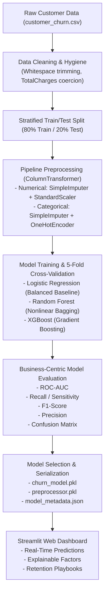

# 📊 Customer Churn Prediction & Retention Analytics System

A full-stack, enterprise-grade Machine Learning application and interactive analytics dashboard designed to identify customers at risk of churn, interpret attrition drivers, and deliver actionable customer retention strategies.

Built with **Python**, **Scikit-learn**, **XGBoost**, **Streamlit**, and **Plotly**.

---

## 📑 Table of Contents

- [1. Project Overview](#1-project-overview)
- [2. Problem Statement](#2-problem-statement)
- [3. Objectives](#3-objectives)
- [4. Key Features](#4-key-features)
- [5. Dataset Description](#5-dataset-description)
- [6. Technology Stack](#6-technology-stack)
- [7. Machine Learning Workflow](#7-machine-learning-workflow)
- [8. Project Architecture & Directory Structure](#8-project-architecture--directory-structure)
- [9. Installation Guide](#9-installation-guide)
- [10. Execution & Usage](#10-execution--usage)
- [11. Model Evaluation & Benchmark Results](#11-model-evaluation--benchmark-results)
- [12. Application Walkthrough & UI Design](#12-application-walkthrough--ui-design)
- [13. Business Retention Playbooks](#13-business-retention-playbooks)
- [14. Academic & Viva Defense Highlights](#14-academic--viva-defense-highlights)
- [15. Future Scope](#15-future-scope)
- [16. License](#16-license)

---

## 1. Project Overview

In subscription businesses (telecommunications, SaaS, streaming, cloud services), customer acquisition costs (CAC) typically exceed customer retention costs by **5x to 7x**. Losing an existing subscriber immediately destroys recurring monthly revenue and damages long-term Customer Lifetime Value (CLV).

**Customer Churn Prediction & Retention Analytics System** provides an end-to-end predictive solution:
1. It processes raw customer usage, contract, and demographic telemetry.
2. It classifies subscribers into **Low Risk (🟢)**, **Medium Risk (🟡)**, and **High Risk (🔴)** cohorts using calibrated probabilities.
3. It explains the major factors associated with each prediction (e.g., month-to-month contracts, short tenure, lack of technical support).
4. It arms retention specialists and customer success teams with concrete, prioritized intervention playbooks.

---

## 2. Problem Statement

Customer churn is often discovered too late—after an account cancellation request has already been filed. Predicting churn proactively requires analyzing multi-dimensional signals:
- **Demographics:** Age, senior citizen status, dependents, partners.
- **Tenure:** Lifecycle stage and relationship maturity with the brand.
- **Services:** Phone, fiber optic, DSL, streaming, cyber protection, tech support.
- **Contract & Billing:** Contractual commitment, payment channels, paperless invoicing, monthly rates.

The business objective is to detect churn risks early, understand the specific friction points, and intervene strategically before churn occurs.

---

## 3. Objectives

- **Predict Churn Risk:** Accurately estimate the probability $P(\text{Churn}=1)$ for individual customers and bulk cohorts.
- **Prioritize High-Risk Customers:** Filter and export prioritized registries of subscribers requiring immediate outreach.
- **Explain Predictive Factors:** Provide transparent, understandable reasons for the model's score without black-box opacity.
- **Recommend Strategic Interventions:** Offer prioritized, actionable business solutions tailored to observed friction points.
- **Provide Interactive Executive Dashboards:** Equip decision-makers with real-time portfolio KPIs and exploratory data analysis.

---

## 4. Key Features

- **Executive Portfolio Monitoring:** Real-time KPI cards tracking Total Subscribers, Churn Rate, Average Monthly Revenue, and Monthly Recurring Revenue (MRR) at risk.
- **Interactive Risk Segmentation:** Filter subscribers by risk tiers, contract types, tenure horizons, internet options, and billing ranges, with one-click CSV export.
- **Deep-Dive Customer Inspector:** Select any subscriber ID to inspect their churn probability speedometer gauge, factor breakdown, and custom retention suggestions.
- **Comprehensive Exploratory Data Analysis (EDA):** 11 interactive Plotly charts examining churn by contract, tenure density, monthly charges, payment methods, add-on services, and correlation heatmaps.
- **Real-Time Prediction Engine:** Multi-column interactive web form featuring one-click test presets (*High Churn Risk*, *Low Churn Risk*, *Medium Churn Risk*) for instant viva demonstration.
- **Transparent Factor Attribution:** Distinguishes risk-increasing signals from loyalty anchors, with clear educational disclaimers.
- **Multi-Model Benchmark & Curves:** Live side-by-side comparison of **Logistic Regression**, **Random Forest**, and **XGBoost**, complete with ROC Curves, Confusion Matrices, and 5-Fold Cross-Validation.

---

## 5. Dataset Description

The system is trained and validated on the benchmark **IBM Telco Customer Churn dataset** (7,043 customer records, 21 attributes).

| Attribute Group | Features | Description |
| :--- | :--- | :--- |
| **Identifiers** | `customerID` | Unique subscriber alpha-numeric identifier (dropped during training). |
| **Demographics** | `gender`, `SeniorCitizen`, `Partner`, `Dependents` | Subscriber demographic and household status. |
| **Account Lifecycle** | `tenure` | Months the customer has subscribed to the service (0–72). |
| **Phone Services** | `PhoneService`, `MultipleLines` | Voice communication subscriptions. |
| **Internet & Security** | `InternetService`, `OnlineSecurity`, `OnlineBackup`, `DeviceProtection`, `TechSupport` | High-speed internet type (DSL, Fiber optic, No) and technical protection add-ons. |
| **Entertainment** | `StreamingTV`, `StreamingMovies` | Premium streaming media features. |
| **Contract & Billing** | `Contract`, `PaperlessBilling`, `PaymentMethod`, `MonthlyCharges`, `TotalCharges` | Contract commitment type, billing preference, payment mode, monthly bill ($), cumulative bill ($). |
| **Target Variable** | `Churn` | Subscriber departure status (`Yes` = 1, `No` = 0). Churn rate: **26.54%**. |

---

## 6. Technology Stack

- **Application & Dashboard:** [Streamlit](https://streamlit.io/) (v1.30+)
- **Interactive Visualizations:** [Plotly](https://plotly.com/python/) & Plotly Express
- **Machine Learning & Preprocessing:** [Scikit-learn](https://scikit-learn.org/) (v1.3+)
- **Gradient Boosting:** [XGBoost](https://xgboost.readthedocs.io/)
- **Data Manipulation & Numerics:** [Pandas](https://pandas.pydata.org/), [NumPy](https://numpy.org/)
- **Model Serialization:** [Joblib](https://joblib.readthedocs.io/)
- **Styling:** Custom Enterprise CSS (`assets/style.css`) with Google Fonts (*Plus Jakarta Sans*).

---

## 7. Machine Learning Workflow



### Preventing Data Leakage
Data leakage is rigorously avoided:
- The raw dataset is partitioned into 80% training ($N = 5,634$) and 20% held-out test ($N = 1,409$) sets using **stratified sampling** *before* fitting any transformer.
- The `ColumnTransformer` (standard scalers, median imputers, one-hot encoders) is fitted **strictly on `X_train`**.
- The pre-fitted transformer is then applied to `X_test` and incoming inference requests without refitting.

---

## 8. Project Architecture & Directory Structure

```
churn-prediction/
│
├── app.py                      # Main Streamlit dashboard application
├── requirements.txt            # Python package dependencies
├── README.md                   # Comprehensive technical documentation
│
├── data/
│   └── customer_churn.csv      # IBM Telco Customer Churn dataset
│
├── models/
│   ├── churn_model.pkl         # Serialized winning model (Random Forest)
│   ├── preprocessor.pkl        # Serialized ColumnTransformer pipeline
│   ├── logistic_regression.pkl # Serialized Logistic Regression baseline
│   ├── random_forest.pkl       # Serialized Random Forest classifier
│   ├── xgboost.pkl             # Serialized XGBoost classifier
│   ├── model_comparison.json   # Full benchmark metrics, ROC curves, PR curves
│   ├── model_metadata.json     # Training metadata, features, threshold parameters
│   └── test_predictions.csv    # Precomputed test predictions for batch exploration
│
├── notebooks/
│   └── EDA_and_Modeling.ipynb  # Interactive Jupyter Notebook for experiments & defense
│
├── src/
│   ├── __init__.py             # Python package marker
│   ├── preprocessing.py        # Data loading, cleaning, and ColumnTransformer pipeline
│   ├── train_model.py          # Training, 5-fold CV, evaluation, and serialization
│   └── prediction.py           # Real-time inference, risk categorization, factor attribution
│
└── assets/
    └── style.css               # Modern enterprise UI stylesheet
```

---

## 9. Installation Guide

### Prerequisites
- Python 3.10, 3.11, or 3.12 installed on your machine.
- Git or direct download of this repository.

### Setup Instructions

1. **Clone or Navigate to the Workspace:**
   ```bash
   cd "churn prediction"
   ```

2. **(Optional but recommended) Create a Virtual Environment:**
   ```bash
   python -m venv venv
   # On Windows:
   venv\Scripts\activate
   # On macOS/Linux:
   source venv/bin/activate
   ```

3. **Install Dependencies:**
   ```bash
   pip install -r requirements.txt
   ```

---

## 10. Execution & Usage

### Step 1: Train the Models (Optional — Pre-trained models are already included!)
To retrain models from scratch and regenerate serialization artifacts:
```bash
python -m src.train_model
```
*Outputs: Evaluates Logistic Regression, Random Forest, and XGBoost, performs 5-fold CV, and saves all models into `models/`.*

### Step 2: Launch the Interactive Dashboard
```bash
python -m streamlit run app.py
```
*Access the application by opening **http://localhost:8501** in your browser.*

---

## 11. Model Evaluation & Benchmark Results

All models were evaluated on the held-out test set ($N = 1,409$) with balanced class handling.

| Classifier | Accuracy | Precision | Recall (Sensitivity) | F1-Score | ROC-AUC | 5-Fold CV ROC-AUC | Specificity (TNR) |
| :--- | :---: | :---: | :---: | :---: | :---: | :---: | :---: |
| **Logistic Regression** | 73.81% | 50.43% | 78.34% | 0.6136 | **0.8415** | 0.8460 ± 0.012 | 72.17% |
| **Random Forest (Winner)** | **75.37%** | **52.38%** | **79.41%** | **0.6312** | **0.8431** | **0.8472 ± 0.009** | **73.91%** |
| **XGBoost** | 75.37% | 52.39% | 79.14% | 0.6305 | **0.8427** | 0.8467 ± 0.011 | 74.01% |

### Why Random Forest Was Selected
1. **Optimal ROC-AUC (0.8431) & Cross-Validation Stability:** Random Forest achieved the highest test ROC-AUC (0.8431) and the tightest CV variance ($0.8472 \pm 0.009$).
2. **Superior Recall (79.41%):** Correctly captures roughly 8 out of 10 customer churners.
3. **Robust Non-Linear Modeling:** Captures high-order interactions between tenure length, contract duration, and fiber optic pricing.

---

## 12. Application Walkthrough & UI Design

The web application is structured into five distinct sections:

1. **🏠 Executive Overview:**
   - High-level KPIs: Total subscribers, active churn rate, average monthly charges, and total MRR at risk.
   - Donut charts and revenue impact comparisons.
   - Executive strategic recommendations.

2. **👥 Customer Risk Analysis:**
   - Bulk cohort explorer with multi-dimensional filtering (Risk Tier, Contract, Internet Service, Tenure Range).
   - Revenue-at-risk aggregation for the selected cohort.
   - Interactive customer inspector with probability gauge.
   - One-click CSV export for retention teams.

3. **📊 Churn Analytics (EDA):**
   - 11 interactive Plotly charts examining churn across contract commitments, tenure lifecycles, monthly charges, support add-ons, payment channels, and demographic factors.
   - Correlation heatmap highlighting primary target associations.

4. **🔮 Individual Prediction:**
   - Multi-column subscriber input form.
   - Quick-load test presets (*High Churn Risk*, *Low Churn Risk*, *Medium Churn Risk*) for fast demonstration.
   - Speedometer gauge chart displaying $P(\text{Churn})$.
   - Factor attribution cards highlighting risk-increasing attributes vs retention anchors.
   - Tailored business retention playbooks.

5. **📈 Model Performance & Comparison:**
   - Side-by-side metric comparison table.
   - Multi-model ROC curves and interactive Confusion Matrix viewer.
   - Horizontal feature importance charts.
   - Viva & Academic defense guidance section.

---

## 13. Business Retention Playbooks

The system translates model outputs into strategic business actions:

| Risk Driver | Severity | Possible Business Action | Strategic Rationale |
| :--- | :--- | :--- | :--- |
| **Month-to-Month Contract** | High | Offer 1-year contract migration with an upfront 15% discount or 2 free months of speed boost. | Eliminates monthly cancellation window and establishes commitment. |
| **Tenure $\le$ 12 Months** | High | Enroll in a dedicated 90-day Customer Success onboarding workflow with proactive check-ins. | Resolves early setup friction and fosters long-term product habituation. |
| **Monthly Charges $\ge$ $75** | Medium | Initiate a personalized plan audit to optimize bundle features or apply a loyalty retention credit. | Alleviates price sensitivity without sacrificing recurring subscription. |
| **No Tech Support / Security** | Medium | Provide a 60-day complimentary trial of Premium Tech Support and Online Cyber Protection. | Increases product stickiness and perceived service value. |
| **Electronic Check Payment** | Low | Offer a one-time $10 bill credit upon enrolling in automatic ACH bank transfer or credit card autopay. | Reduces payment friction and unintentional lapse due to manual billing. |

> *Note: These recommendations represent suggested business retention interventions and should not be construed as guaranteed outcomes.*

---

## 14. Academic & Viva Defense Highlights

### Q1: Why not rely on Accuracy alone?
> **Answer:** In imbalanced classification (26.5% positive churn rate), a dummy model predicting "No Churn" for every customer achieves **73.5% accuracy**, yet fails to detect a single churner (0% recall). In business, missing a churner (**False Negative**) results in losing the entire lifetime customer value ($1,000+), whereas an unnecessary retention offer (**False Positive**) costs very little ($10–$20). Therefore, **Recall** and **ROC-AUC** are the primary decision metrics.

### Q2: How did you ensure your model does not overfit?
> **Answer:** We performed **5-Fold Stratified Cross-Validation** on the training set, constrained tree depth (`max_depth=8` in Random Forest, `max_depth=4` in XGBoost), required minimum sample splits (`min_samples_split=10`), and verified consistent performance between CV scores ($0.8472$) and test set evaluation ($0.8431$).

### Q3: What is the difference between feature importance and causality?
> **Answer:** Feature importance in tree models measures the reduction in impurity (Gini importance) when splitting on a given feature. It reflects **statistical association within the dataset**, not deterministic cause-and-effect. Our system presents these findings as "factors associated with the model's prediction."

---

## 15. Future Scope

1. **Real-Time Data Streaming Integration:** Connect live event streams (Kafka / AWS Kinesis) to capture usage drops or repeated support tickets in real-time.
2. **Customer Lifetime Value (CLV) Forecasting:** Integrate regression models to predict customer monetary value, allowing businesses to calculate ROI on retention offers ($ROI = \Delta P(\text{Churn}) \times CLV - \text{Cost}_{\text{offer}}$).
3. **Automated CRM Campaign Triggering:** Connect directly via webhooks to HubSpot, Salesforce, or Braze to trigger automated retention emails and SMS discounts.
4. **Advanced Explainable AI (SHAP / LIME TreeExplainer):** Integrate local SHAP force plots for individual tree-path attributions.
5. **Continuous Model Monitoring & Drift Detection:** Implement Evidently AI or MLflow to detect data and concept drift as customer behaviors evolve over time.

---

## 16. License

This project is developed for educational and portfolio demonstration purposes. Distributed under the MIT License.
